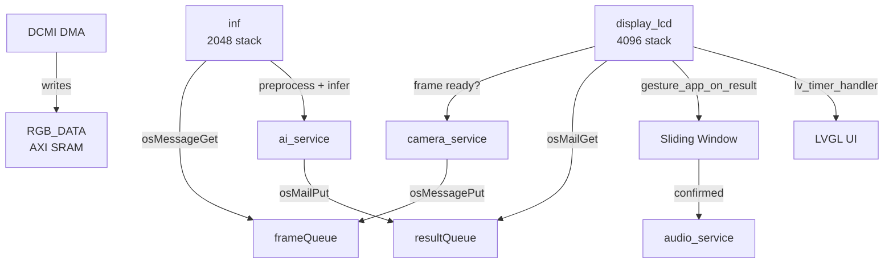

# Sign2Voice — Real-time Sign Language Recognition on STM32H743

[](https://www.st.com/en/microcontrollers-microprocessors/stm32h743vi.html)
[](https://lvgl.io/)
[](https://www.st.com/en/embedded-software/x-cube-ai.html)
[](LICENSE)

> **Real-time, fully offline hand gesture recognition on an STM32 microcontroller.**
> Point a camera at your hand — the device speaks the recognized gesture aloud.

---

## Features

- **5 gestures**: Fist, Like, OK, Palm, No-Gesture (mute)
- **Real-time**: ~6 FPS end-to-end (135 ms INT8 inference)
- **Fully offline**: No connectivity required — everything runs on STM32H743
- **Voice feedback**: MP3-TF-16P module speaks recognized gestures
- **Interactive menu**: LVGL v9 GUI with configurable settings
- **Persistent configuration**: Settings survive power cycles (Flash storage)
- **Custom model ready**: Swap any X-CUBE-AI compatible `.tflite` model

## Hardware

| Component | Part |
|---|---|
| MCU | STM32H743VIT6 (Cortex-M7 @400MHz, 2MB Flash, 1MB SRAM) |
| Camera | OV2640 (200W pixel, DCMI interface) |
| Display | ILI9341 SPI LCD (320×240, RGB565) |
| Audio | MP3-TF-16P (YX5200 UART, microSD) |
| Debug | ST-Link V2 |

## Architecture (v2.1)

```
┌─────────────────────────────────────────────────┐
│                  APPLICATION                     │
│  ┌──────────┐ ┌──────────┐ ┌──────┐ ┌────────┐ │
│  │  Menu    │ │ Gesture  │ │Settings│ │ Status │ │
│  └──────────┘ └──────────┘ └──────┘ └────────┘ │
├─────────────────────────────────────────────────┤
│                    SERVICE                       │
│  ┌──────────┐ ┌──────────┐ ┌──────┐ ┌────────┐ │
│  │ AI Svc   │ │ Camera   │ │Audio │ │  UI    │ │
│  └──────────┘ └──────────┘ └──────┘ └────────┘ │
├─────────────────────────────────────────────────┤
│                    CONFIG                        │
│  ┌──────────────┐ ┌──────────────┐ ┌──────────┐ │
│  │    Config    │ │   Storage    │ │ ErrorCode│ │
│  └──────────────┘ └──────────────┘ └──────────┘ │
├─────────────────────────────────────────────────┤
│                    DRIVER                        │
│  ┌──────┐ ┌──────┐ ┌──────┐ ┌──────┐ ┌──────┐  │
│  │OV2640│ │ILI9341│ │ MP3  │ │ KEY  │ │ ADC  │  │
│  └──────┘ └──────┘ └──────┘ └──────┘ └──────┘  │
├─────────────────────────────────────────────────┤
│                      HAL                         │
│              STM32H7xx HAL Library               │
└─────────────────────────────────────────────────┘
```

### Project Structure

```
Sign2Voice/
├── App/                    # Application layer
│   ├── gesture_app.c/h     #   Recognition pipeline, sliding-window, cooldown
│   └── app_init.c/h        #   Unified hardware + service init
├── Service/                # Service layer (hardware abstraction)
│   ├── ai_service.c/h      #   X-CUBE-AI wrapper, model-agnostic API
│   ├── camera_service.c/h  #   OV2640 + DCMI + frame capture
│   ├── audio_service.c/h   #   MP3 playback, class→track mapping
│   └── ui_service.c/h      #   LVGL overlay + display refresh
├── Config/                 # Configuration management
│   └── config.c/h          #   SystemConfig struct, get/set/load/save/reset
├── Storage/                # Persistent storage
│   └── flash_storage.c/h   #   Internal Flash read/write
├── Common/                 # Shared definitions
│   └── error_code.h        #   Unified ErrorCode enum
├── Debug/                  # Compile-time logging
│   └── log.h/c             #   LOG_INFO / LOG_WARN / LOG_ERROR macros
├── Docs/                   # Developer documentation
│   ├── Architecture.md     #   Layer diagram, module list, task model, data flow
│   ├── Configuration.md    #   SystemConfig, Flash storage API, debug history
│   ├── ErrorHandling.md    #   Error codes, fault handlers, pipeline resilience
│   ├── DebugGuide.md       #   Log levels, UART output, FreeRTOS debugging
│   └── MemoryLayout.md     #   RAM regions, Flash layout, scatter file, allocations
├── Core/
│   ├── Src/
│   │   ├── freertos.c      #   3 RTOS tasks (display, inference, audio)
│   │   ├── main.c          #   System entry, clock config
│   │   ├── menu.c/h        #   Multi-page settings menu
│   │   └── ui_overlay.c/h  #   LVGL camera overlay
│   └── Inc/                #   FreeRTOSConfig, lv_conf, HAL conf
├── HARDWARE/TIMER/         #   Drivers (OV2640, ILI9341, MP3, KEY, LED, ...)
├── X-CUBE-AI/App/          #   AI model (5-class gesture classifier)
└── MDK-ARM/                #   Keil / EIDE project files
```

## RTOS Task Model

Three FreeRTOS tasks communicate via Message Queue and Mail Queue, separating
camera capture, AI inference, and UI rendering into independent execution units.
This design keeps the display responsive during inference (no single task blocks
the pipeline) and allows each task to run at the appropriate priority.

| Task | Priority | Stack | Role |
|---|---|---|---|
| `display_lcd` | Normal | 4096 B | Camera preview, LVGL rendering, FPS counting, key scan, menu navigation |
| `inf` | Normal | 2048 B | Blocks on frame queue → preprocess → AI inference → posts result via mail queue |
| `mp3` | BelowNormal | 1024 B | Idle (playback is driven by the display task synchronously) |

**Message Queue** (`frameQueue`, depth 4): The display task sends a trigger
whenever a new camera frame is available and the system is idle. The inference
task blocks on this queue — no polling, no wasted CPU.

**Mail Queue** (`resultQueue`, depth 2): The inference task allocates a
`ui_event_t {class, probability, inference_ms}` and posts it after each run.
The display task dequeues the result, applies sliding-window consensus,
updates the LVGL overlay, and triggers audio playback.



## Configuration System (v2.1)

A unified `SystemConfig` struct provides the single source of truth for all
user-adjustable parameters. All modules read settings through `config_get_*()`
rather than through scattered global variables.

| Parameter | Range | Default | Description |
|---|---|---|---|
| Volume | 0–30 | 20 | MP3 speaker volume |
| Threshold | 50–95 % | 70 % | Minimum confidence for gesture confirmation |
| Window Size | 3 / 5 / 7 | 5 | Consecutive consistent frames required |

**Persistence**: Settings are written to internal Flash when the user exits a
settings page (long-press KEY2). On next boot, `config_load()` reads them back.
Invalid or missing data is rejected by a range sanity check, and factory
defaults are used transparently.

## Error Handling (v2.1)

All Service modules return a unified `ErrorCode` enum instead of raw integers,
making error sources immediately identifiable in the call chain.

| Code | Meaning |
|---|---|
| `ERR_OK` (0) | Success |
| `ERR_CAMERA` | Camera / DCMI failure |
| `ERR_AI` | AI model not initialized or inference failed |
| `ERR_AUDIO` | MP3 module error |
| `ERR_FLASH` | Flash read / write / erase failure |
| `ERR_TIMEOUT` | Operation timed out |
| `ERR_INVALID_PARAM` | Out-of-range or invalid argument |
| `ERR_NULL_POINTER` | Unexpected NULL pointer |

**Gesture pipeline resilience**: A sliding window requires N consecutive
same-class frames above threshold before confirming a gesture. A 2-second
cooldown after each confirmation prevents rapid re-triggering.

## Logging (v2.1)

Three log macros — `LOG_INFO`, `LOG_WARN`, `LOG_ERROR` — provide structured
debug output via UART. Logging is controlled at compile time through a single
`#define LOG_LEVEL` in `Debug/log.h`:

```c
#define LOG_LEVEL LOG_LEVEL_NONE   // production: zero overhead
#define LOG_LEVEL LOG_LEVEL_ERROR  // errors only
#define LOG_LEVEL LOG_LEVEL_WARN   // errors + warnings
#define LOG_LEVEL LOG_LEVEL_INFO   // full debug output
```

When disabled (`LOG_LEVEL_NONE`), all log macros expand to `((void)0)` —
zero CPU cycles, zero Flash bytes, zero UART traffic.

## Memory Layout

| Region | Address | Size | Usage |
|---|---|---|---|
| DTCM | 0x20000000 | 128 KB | Stack, FreeRTOS heap, critical BSS |
| AXI SRAM | 0x24000000 | 512 KB | Camera frame buffer, AI input tensor, activations |
| SRAM1+2 | 0x30000000 | 256 KB | DCMI DMA double-buffer, LVGL draw buffer, flash write code |
| Flash | 0x08000000 | 2 MB | Application code, AI model weights, reserved configuration storage |

## AI Model

| Property | Value |
|---|---|
| Architecture | Custom CNN (X-CUBE-AI generated) |
| Quantization | INT8 (weights + activations) |
| Input | 64×64×3 (preprocessed from RGB565 camera frame) |
| Output | 5 classes: `fist`, `like`, `no_gesture`, `ok`, `palm` |
| Inference time | ~135 ms |
| Flash (weights) | ~216 KB |
| RAM (activations) | ~40 KB |

## Quick Start

### Prerequisites

- STM32CubeIDE, Keil MDK, or [EIDE](https://github.com/github0null/eide) (VSCode extension)
- ST-Link V2 debugger
- Hardware: STM32H743VIT6 + OV2640 + ILI9341 + MP3-TF-16P

### Build & Flash

```bash
# Using EIDE (VSCode)
1. Open project in VSCode with EIDE extension
2. Select target "finaltest"
3. Build → Flash

# Or open MDK-ARM/finaltest.uvprojx in Keil MDK
```

### Deploy a Custom Model

1. Train your TFLite model (input: 64×64×3, output: N-class softmax)
2. Quantize to INT8 using X-CUBE-AI CLI or STM32Cube.AI
3. Replace `X-CUBE-AI/App/gesture.*` with the generated files
4. Update `ai_service_get_class_count()` in `Service/ai_service.c`
5. Update `class_names[]` in `X-CUBE-AI/App/app_x-cube-ai.c`
6. Rebuild → Flash

## Documentation

| Document | Contents |
|---|---|
| [Architecture](Docs/Architecture.md) | Layer diagram, module list, RTOS task model, data flow |
| [Configuration](Docs/Configuration.md) | SystemConfig struct, Flash persistence API, debugging history |
| [Error Handling](Docs/ErrorHandling.md) | ErrorCode enum, module error strategies, fault handlers |
| [Debug Guide](Docs/DebugGuide.md) | Log levels, UART output, FreeRTOS stack/heap monitoring |
| [Memory Layout](Docs/MemoryLayout.md) | RAM/Flash regions, scatter file, key symbol allocations |

## Roadmap

See [plan.md](plan.md) for the full development roadmap.

- [x] v1.0 — Functional prototype (gesture recognition + voice)
- [x] v2.0 — Software architecture refactoring (App/Service/Driver layers)
- [x] v2.1 — Reliability & maintainability (config persistence, error codes, logging, docs)
- [ ] v2.2 — Performance optimization (CMSIS-NN)
- [ ] v2.3 — Extended documentation & developer guide
- [ ] v3.0 — Custom PCB hardware

## License

MIT License © 2026

## Acknowledgments

- [X-CUBE-AI](https://www.st.com/en/embedded-software/x-cube-ai.html) — STM32 AI expansion pack
- [LVGL](https://lvgl.io/) — Light and Versatile Embedded Graphics Library
- [FreeRTOS](https://www.freertos.org/) — Real-time operating system
